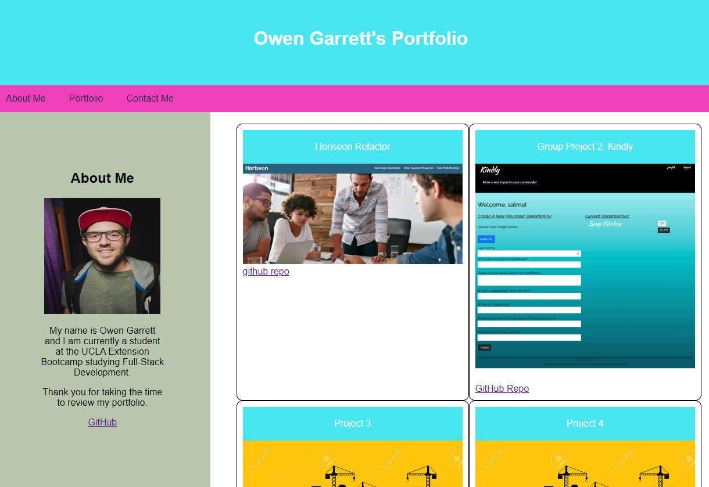

# Portfolio

## Description

Thank you for taking the time to review my portfolio! I am a recent graduate of the UCLA Extension Coding Bootcamp and this portfolio contains several of my projects from the course as well as a few personal projects. Currently, my portfolio is undergoing a redesign therefore it may look incomplete. This is only temporary while I choose which of my projects to highlight. Some of the porjects in my portfolio are Group Projects from class and some will be my own personal projects that I designed myself. 

 
Please feel free to contact me with any questions or suggestions. Your feedback would be greatly appreciated as this project is still under construction! 

## Table of Contents 

- [Installation](#installation)
- [How to use application](#how-to-use-application)
- [URL](#url)
- [Development](#development)
- [Screenshot](#screenshot)
- [Credits](#credits)

## Installation

This portfolio was designed using HTML5; CSS; and VS Code. 

## How to use application

You may access my portfolio by clicking the URL in the URL section of this README.md document.  

## URL 

<a href ="https://owengarrett.github.io/Portfolio/" target="_blank">Access Portfolio</a>

## Development 

Orignally, I designed an HTML portfolio as part of my first week of my coding bootcamp. I had zero prior coding or development expereince prior to the bootcamp. Now that I have passed the course and gained a new passion, I am revisiting this project so that it may more accurately reflect my professional skills.  

## Screenshot

## Credits

Owen Garrett

:alien::yin_yang:

